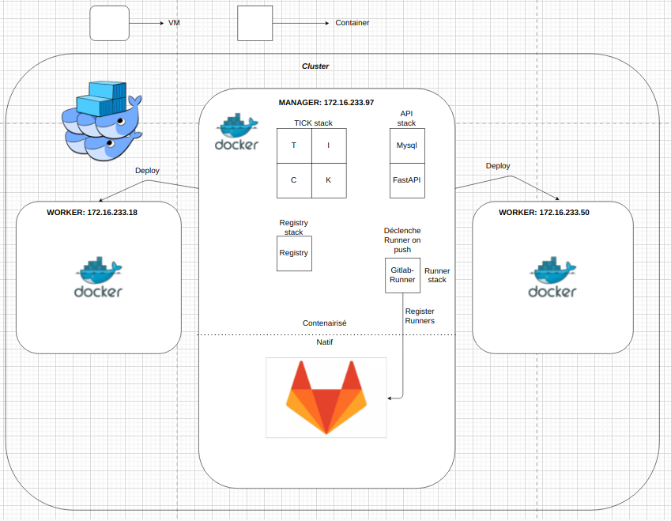

# Groupe de obadia_r 874015

# Content

- /api                    : Contient toute l'api de reservation d'hôtel (sources, tests, CI, Dockerfile)
- /inventory              : Contient toutes les ip à utiliser pour la mise en place de l'architecture
- /roles                  : Contient tous les rôles Ansible utilisés par les playbook
- infrastucture.yml       : Playbook pour mettre en place l'infra (Installation Docker, Swarm, Registry)
- gitlab-playbook.yml     : Playbook pour la gestion de Gitlab sur la VM2
- run.sh                  : Script de lancement des playbook

## Description

Ce projet automatise la mise en place d'une stack swarm à partir de plusieurs fichiers docker-compose.

Le script de lancement execute 2 playbook:
- Un pour la mise en place de l'infrastructure
- Un pour la configuration d'un Gitlab natif


## Usage

- Pouvoir se connecter par clé ssh sur les 3 VM avec son nom d'utilisateur ETNA
- Changer l'utilisateur remote par défaut dans chaque playbook
- Tester la connexion avec la commande de ping commentée dans run.sh
- Une fois la connexion établit, lancer le/les playbook avec run.sh


## ReadMe API
[Lien](api/README.md)


## Ansible Vault

Le fichier roles/gitlab/vars/vault.yml contient les variables sensibles (tokens api...)

Ces commandes nécessite le mot de passe du fichier

```bash
# Pour ajouter une variable au fichier crypté: 
ansible-vault edit roles/gitlab/vars/vault.yml

# Pour lire le fichier crypté: 
ansible-vault view roles/gitlab/vars/vault.yml
```

## Architecture 



## CI/CD
Il existe une pipeline qui se declenche sur la branch main.
La ci va tester le code, build et push sur le registry
La cd va deployer la stack sur le swarm
Traefik s'occupe de la redirection  entre L'api et le dashboard traefik
l'api routing: http://api.booking-api-etna-clo5.online/docs
le dashboard routing: http://dashboard.booking-api-etna-clo5.online/